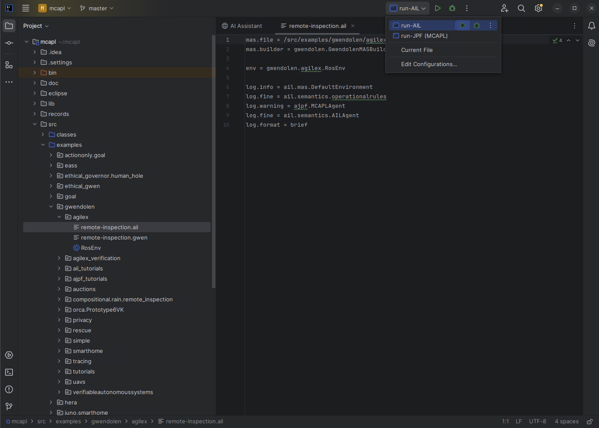

---

# **Safe-ROS**  
An Architecture for Autonomous Robots in Safety-Critical Domains
---

This repository provides a Docker-based setup for experimenting with [MCAPL](https://github.com/mcapl/mcapl) tools in the [EEE Radiation Store Gazebo simulation](https://github.com/EEEManchester/gazebo_radiation_plugin), facilitated via Docker Compose. It integrates key components for autonomous robot development and verification, including [FRET](https://github.com/NASA-SW-VnV/fret) for formal requirements elicitation, [Java ROSBridge](https://github.com/h2r/java_rosbridge) for communication with ROS, [AgileX robotic packages](https://github.com/agilexrobotics/scout_ros) for robot control and simulation, and [Dafny](https://dafny.org/) for formal verification.


---

## **How to Run This Project**  

### **1. Clone the Repository**  
First, clone the repository to your local environment:  

```sh
git clone ....
cd Safe-ROS
```

### **2. Build and start the Containers with Docker Compose**  
### Running the Containers
Instead of manually building and running the container, use `docker-compose` to handle everything:

Build the necessary images (if not already built):

```sh
docker compose build --no-cache
```

Start the containers in detached mode (`-d` flag):
```sh
docker compose up -d
```

### Stopping the Containers
To stop all running containers:

```sh
docker compose down
```


<!--
### **2. Build the Docker Image**  
Use one of the following commands to build your Docker image:  

#### **Using `docker build`**
```sh
docker build -t YOUR_IMAGE_NAME:YOUR_IMAGE_TAG .
```

#### **Using `docker buildx` (for different architectures)**
- **For amd64**  
  ```sh
  docker buildx build --platform=linux/amd64 --progress=plain -t YOUR_IMAGE_NAME:YOUR_IMAGE_TAG .
  ```
- **For arm64**  
  ```sh
  docker buildx build --platform=linux/arm64 --progress=plain -t YOUR_IMAGE_NAME:YOUR_IMAGE_TAG .
  ```

> Replace `YOUR_IMAGE_NAME` and `YOUR_IMAGE_TAG` with your preferred image name and tag.

#### **Example (What I'm Running)**
```sh
docker buildx build --platform=linux/amd64 --progress=plain -t ros-noetic:radiation-storage .
```

---

### **3. Run the Docker Container**  
Start the container and expose it on port **6080**:

```sh
docker run -p 6080:80 --security-opt seccomp=unconfined --shm-size=512m --name YOUR_CONTAINER_NAME IMAGE:VERSION
```

> Replace `YOUR_CONTAINER_NAME` with your desired container name.

#### **Example (What I'm Running)**
```sh
docker run -p 6080:80 --security-opt seccomp=unconfined --shm-size=512m --name radiation-storage ros-noetic:radiation-storage
```

-->

### **3. Access the Container UI**  
Once the container is running, open your browser and go to:
👉 **[http://localhost:6080/](http://localhost:6080/)**  


---

## **Running the Gazebo Radiation Demonstration**  


1. Navigate to the catkin workspace and build:  
   ```sh
   cd catkin_ws/ && catkin_make
   source devel/setup.bash
   ```

2. Start the simulation:  
   ```sh
   roslaunch scout_gazebo_sim gazebo_nuclear_inspection.launch
   ```

3. Open another terminal run lidar:  
   ```sh
   cd catkin_ws/
   source devel/setup.bash
   roslaunch scout_gazebo_sim open_rslidar.launch
   ```

At this point you can run the autonomous inspection without the agent, by runing in a new terminal:
   ```sh
   cd catkin_ws/
   source devel/setup.bash
   rosrun simple_navigation_goals simple_navigation_goals
   ```
and you will see the robot visiting three inspection point in the map (note that while trying to reach inspection point 3, the robot is geting quite close to the walls - Something that in future will trigger our Safety System)

---

## **MCAPL Setup in IntelliJ**  

### **1. Open IntelliJ**
Open a new terminal and locate the MCAPL folder and then run IntelliJ :  
```sh
cd MCAPL/
intellij .
```
At this point you'll se the **MCAPL** project in intellij interface.

### **2. Build the Project**
- Use the **Ant** plugin to build the project (click the **Ant symbol** in the top-right corner of IntelliJ).  
- Ensure there are **no errors**.
- [OPTIONAL] to test MCAPL, run a simple example programs in `src/examples` as described in the **[MCAPL manual – Chapter 3](https://github.com/mcapl/mcapl/tree/master/doc/manual)**.

---

## **MCAPL and ROS Bridge Setup**  

1.  In IntelliJ, open the **MCAPL** project and navigate to:  
   ```
   src/examples/gwendolen/agilex/remote_inspection.ail
   ```
4. Right-click **`remote-inspection.ail`** → **Run As > Run Configurations**  




---

## **Java_rosbridge Setup**  

> **Note**  
> The `java_rosbridge` folder is already updated, and the `.jar` file has been integrated into the MCAPL framework.  
> These setup steps are still included in case you need to modify the `.jar` file, such as when adding support for more messages between Gwendolen and ROS.  
> If you're using the current `.jar` and do not need any changes, you can skip directly to the [MCAPL and ROS Bridge Setup](#mcapl-and-ros-bridge-setup) section.


1. Navigate to the `java_rosbridge` directory:  
   ```sh
   cd java_rosbridge
   ```

2. Compile the project:  
   ```sh
   mvn compile
   ```

3. Create the target `.jar` file and Java documentation:  
   ```sh
   mvn package
   ```

### **Java_rosbridge Integration with MCAPL**
After running the above commands, a new folder named **`target`** will be created in the **`java_rosbridge`** project. Inside this folder, you'll find the **`.jar`** file that needs to be included in the **MCAPL** project as a library.  

**Note:** You will want to rename the java_rosbridge-2.0.2-jar-with-dependencies.jar to java_rosbridge_all.jar and replace it in the MCAPL lib-3rd party folder.

This enables communication between **Gwendolen** and **ROS (via ROS Bridge)**.  
> If you're adding additional messages, modify the `.jar` file accordingly.


